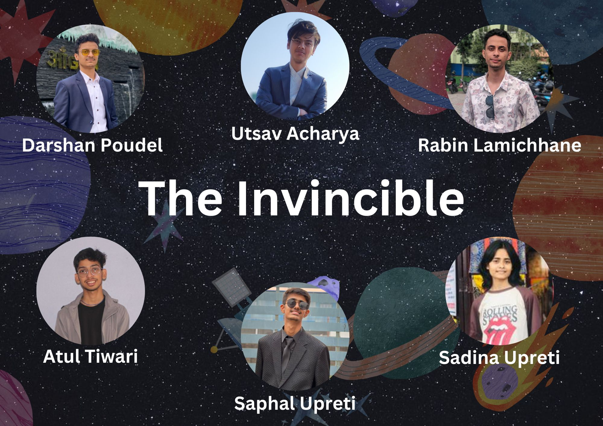

# Celestial-Odyessy

Welcome to the Celestial Odyssey! This immersive application offers an exciting journey through our solar system, providing an educational and interactive experience for users interested in space tourism. Whether you're a curious child or an adult with a passion for the cosmos, this simulation has something for everyone.


## Table of Contents
1. [Introduction](#introduction)
2. [Key Features](#key-features)
3. [Installation](#installation)
4. [Usage](#Usage)
5. [Special Features](#special-features)
6. [FAQs](#faqs)
7. [Contributing](#contributing)
8. [License](#license)
9. [Contributors](#contributors)
10. [References](#references)

---

## Introduction

The Celestial Odyssey project was developed with the aim of providing a thrilling and educational experience for those interested in exploring the planets of our solar system. This interactive application is a perfect blend of education and entertainment, making it an ideal tool for schools, space tour visualization, science centers, and all space enthusiasts.

## Key Features

### 3D Planet Exploration
- Embark on a mesmerizing 3D tour of each planet in our solar system.
- Get up close and personal with each planet's unique surface features.

### Planet Details
- Dive into in-depth information about each planet, including:
  - Primary minerals found on the planet's surface.
  - Composition of the planet's atmosphere.
  - The number of natural satellites (moons) and their names.
  - Surface temperatures and climate conditions.

### Immersive Sound Effects
- Enhance your exploration with captivating sound effects tailored to each planet.
- Experience seamless transitions with "wrap" sound effects when moving between planets.

### Interactive AI Guide
- Engage with an AI guide that offers comprehensive descriptions and facts about each planet.
- Ask questions related to space tourism and receive informative responses.

### Location-Based Exploration
- Utilize latitude and longitude coordinates to explore specific locations on each planet.
- Discover renowned landmarks and geological wonders.

## Installation

To start your Space Tourism 3D Planet Exploration adventure, follow these steps:

1. Clone the project's GitHub repository:

   ```bash
   git clone https://github.com/clerisyutsav47/Celestial-Odyssey.git

2. Install the necessary dependencies:

    ```bash
    npm install

3. Launch the application : 

    ```bash
    npm run dev


## Usage

1. Upon launching the application, you'll be presented with a stunning 3D model of our solar system's planets.

2. Click on any planet to access a wealth of detailed information, including minerals, gas composition, natural satellites, and surface temperatures.

3. Immerse yourself in the accompanying sound effects that enhance the experience.

4. Engage with the AI bot to learn more about the planets and inquire about intriguing solar system topics.

5. Navigate to specific planetary coordinates using the location-based exploration feature.


## Special Features

In addition to the core features, our Solar System 3D Planet Simulation offers some unique elements:

+ Educational Emphasis: While primarily designed for children's visualization and interactive learning, adults can also benefit from this educational tool.

+ NASA Hackathon Focus: Our project aligns with the goals of the NASA Hackathon, emphasizing scientific accuracy and educational value.


## FAQs

### Q: Is this application suitable for educational purposes?
A: Absolutely! This application is an excellent educational resource, making it ideal for schools, science centers, and home-based learning.

### Q: Can I contribute to this project?
A: Of course! We welcome contributions from developers, educators, and space enthusiasts. Please refer to the Contributing section for guidelines.


## Contributing

We appreciate your interest in contributing to the Solar System 3D Planet Simulation project. To contribute, please follow these steps:

1. Fork the repository to your GitHub account.

2. Create a new branch for your feature or bug fix:
    ```bash
    git checkout -b feature/your-feature

3. Implement your changes and commit theM:
    ```bash
    git commit -m "Add your feature or fix"

4. Push your changes to your forked repository
    ```bash 
    git push origin feature/your-feature

5. Create a pull request to submit your changes for review.


## License

This project is licensed under the MIT License - see the LICENSE file for details.

## Contributors


## References
+ 
+
+
+
+


Thank you for choosing the Solar System 3D Planet Simulation! Embark on an educational adventure and explore the beauty and mysteries of our planetary neighbors.

